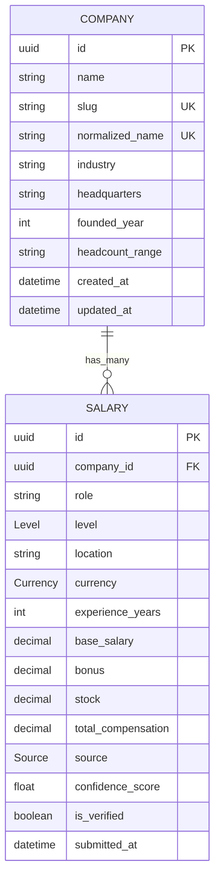

# Database Overview

TalentDash uses PostgreSQL with Prisma as the ORM. The database is intentionally small for the trial scope and models only the current product surface:

* Companies
* Salaries

The schema is designed around one primary relationship:

* One `Company` has many `Salary` records
* One `Salary` belongs to exactly one `Company`

The database must support:

* Strict data normalization for company identity
* Server-side recomputation of derived compensation values
* Fast filtering and ranking for salary discovery pages
* Reliable deduplication and comparison queries
* Static and ISR-backed page generation with low read overhead

Design priorities:

1. Data integrity
2. Deterministic derived values
3. Query performance
4. SEO-friendly lookup patterns
5. Simple schema evolution

This document defines the canonical database shape and the rules an engineer should follow when writing `schema.prisma`.

---

# Entity Relationship Diagram

Notes:

* `slug` and `normalized_name` are unique company identifiers for routing and deduplication.
* `total_compensation` is a stored derived field, but its value must always be computed by the server before insert or update.
* The diagram intentionally omits future entities such as reviews, interviews, and community objects.

---

# Prisma Enums

## `Level`

Allowed values:

* `L3`
* `L4`
* `L5`
* `L6`
* `SDE_I`
* `SDE_II`
* `SDE_III`
* `STAFF`
* `PRINCIPAL`
* `IC4`
* `IC5`

Purpose:

* Normalizes role seniority across companies and sources
* Supports structured filtering, aggregation, and comparison

Constraint:

* Must be a hard enum, not free text

## `Currency`

Allowed values:

* `INR`
* `USD`
* `GBP`
* `EUR`

Purpose:

* Enables formatting and comparison
* Keeps compensation records currency-aware for future conversion layers

Constraint:

* Must be a hard enum

## `Source`

Allowed values:

* `CONTRIBUTOR`
* `SCRAPED`
* `AI_INFERRED`

Purpose:

* Tracks the provenance of each salary row
* Supports trust scoring and moderation workflows

Constraint:

* Must be a hard enum

---

# Company Model

## Purpose

Represents a canonical employer record. Companies are the primary dimension for company pages, salary aggregation, comparison, and SEO routes.

## Fields

### `id`

* Type: `uuid` or equivalent Prisma `String @id @default(uuid())`
* Constraints:
  * Primary key
  * Immutable
  * Required
* Indexes:
  * Primary key index
* Purpose:
  * Internal stable identifier used by foreign keys and joins

### `name`

* Type: `string`
* Constraints:
  * Required
  * Stored as a human-readable display name
  * Should preserve canonical capitalization for UI display
* Indexes:
  * No dedicated index required
* Purpose:
  * Display value shown to users

### `slug`

* Type: `string`
* Constraints:
  * Required
  * Unique
  * Lowercase
  * URL-safe
  * Generated from `normalized_name`
* Indexes:
  * Unique index
* Purpose:
  * SEO route key for `/companies/{slug}`
  * Human-readable canonical page identifier

### `normalized_name`

* Type: `string`
* Constraints:
  * Required
  * Unique
  * Lowercase
  * Trimmed
  * ASCII-safe slug normalization recommended for storage consistency
* Indexes:
  * Unique index
  * Required lookup index
* Purpose:
  * Deduplication key for company identity
  * Normalized lookup from scraped and contributor data

### `industry`

* Type: `string`
* Constraints:
  * Optional unless product requires it for a specific company
  * Free text, but should be normalized on write if provided
* Indexes:
  * No dedicated index required for trial scope
* Purpose:
  * Descriptive metadata for company pages and future rankings

### `headquarters`

* Type: `string`
* Constraints:
  * Optional
  * Free text
* Indexes:
  * No dedicated index required
* Purpose:
  * Company profile metadata

### `founded_year`

* Type: `int`
* Constraints:
  * Optional
  * Must be a reasonable year if present
  * Recommended range: `1800` through current year
* Indexes:
  * No dedicated index required
* Purpose:
  * Company profile metadata and possible future filters

### `headcount_range`

* Type: `string`
* Constraints:
  * Optional
  * Recommended to store as a normalized bucket such as `1-50`, `51-200`, `201-500`, etc.
* Indexes:
  * No dedicated index required
* Purpose:
  * Company sizing metadata for informational use

### `created_at`

* Type: `datetime`
* Constraints:
  * Required
  * Server-generated
  * Immutable after insert
* Indexes:
  * No dedicated index required
* Purpose:
  * Auditing and lifecycle tracking

### `updated_at`

* Type: `datetime`
* Constraints:
  * Required
  * Auto-updated on write
* Indexes:
  * No dedicated index required
* Purpose:
  * Freshness tracking for ISR and admin workflows

## Company Indexes

### `normalized_name`

Purpose:

* Primary deduplication and lookup key
* Prevents duplicates such as `Google`, `GOOGLE`, and `google`

### `slug`

Purpose:

* Primary public route lookup key
* Ensures one canonical URL per company

## Company Rules

* Company records are canonical and unique by normalized identity
* Display name and normalized identity are separate fields by design
* `slug` must be derived from `normalized_name`, not entered manually

---

# Salary Model

## Purpose

Represents one compensation submission or inferred salary observation tied to a single company.

## Fields

### `id`

* Type: `uuid` or equivalent Prisma `String @id @default(uuid())`
* Constraints:
  * Primary key
  * Immutable
  * Required
* Indexes:
  * Primary key index
* Purpose:
  * Stable row identifier

### `company_id`

* Type: foreign key to `Company.id`
* Constraints:
  * Required
  * Must reference an existing company
  * On delete behavior should be chosen deliberately; for this product, `Restrict` or `Cascade` should be decided based on whether company deletion is ever allowed
* Indexes:
  * Part of composite index `(company_id, level, location)`
* Purpose:
  * Associates salary records with their company

### `role`

* Type: `string`
* Constraints:
  * Required
  * Preserve original value
  * Do not force enum normalization
* Indexes:
  * No required index in this task
* Purpose:
  * Human-readable job title used in display and page generation

### `level`

* Type: `Level`
* Constraints:
  * Required
  * Enum only
* Indexes:
  * Part of composite index `(company_id, level, location)`
  * Part of composite index `(location, level)`
* Purpose:
  * Seniority normalization for filtering and comparisons

### `location`

* Type: `string`
* Constraints:
  * Required
  * Store city-level location only
  * Should be normalized for casing/spacing consistency
* Indexes:
  * Part of composite index `(company_id, level, location)`
  * Part of composite index `(location, level)`
* Purpose:
  * Primary geographic filter dimension for salary pages

### `currency`

* Type: `Currency`
* Constraints:
  * Required
  * Enum only
* Indexes:
  * No required index in this task
* Purpose:
  * Currency-aware salary storage and formatting

### `experience_years`

* Type: `int`
* Constraints:
  * Required
  * Minimum `1`
  * Maximum `50`
* Indexes:
  * No required index in this task
* Purpose:
  * Normalized experience bucket for filtering and comparison

### `base_salary`

* Type: decimal / numeric
* Constraints:
  * Required
  * Must be greater than zero
  * Stored in the smallest currency unit to avoid floating-point drift
* Indexes:
  * No required index in this task
* Purpose:
  * Core compensation component

### `bonus`

* Type: decimal / numeric
* Constraints:
  * Required
  * Default `0`
  * Must never be null
* Indexes:
  * No required index in this task
* Purpose:
  * Variable cash compensation component

### `stock`

* Type: decimal / numeric
* Constraints:
  * Required
  * Default `0`
  * Must never be null
* Indexes:
  * No required index in this task
* Purpose:
  * Equity compensation component

### `total_compensation`

* Type: decimal / numeric
* Constraints:
  * Required
  * Must always equal `base_salary + bonus + stock`
  * Never trusted from client input
  * Always recomputed server-side before persistence
* Indexes:
  * Required standalone index
* Purpose:
  * Primary ranking value for salary pages, sort order, and comparisons

### `source`

* Type: `Source`
* Constraints:
  * Required
  * Enum only
* Indexes:
  * No required index in this task
* Purpose:
  * Captures data provenance

### `confidence_score`

* Type: float / decimal
* Constraints:
  * Required
  * Range `0.0` to `1.0`
* Indexes:
  * No required index in this task
* Purpose:
  * Quality ranking and moderation signal

### `is_verified`

* Type: boolean
* Constraints:
  * Required
  * Default `false`
* Indexes:
  * No required index in this task
* Purpose:
  * Moderation and trust flag

### `submitted_at`

* Type: datetime
* Constraints:
  * Required
  * Server-generated
  * Never trusted from client input
* Indexes:
  * Required standalone index
* Purpose:
  * Recency sorting, freshness filtering, and ingestion timelines

## Salary Indexes

### `(company_id, level, location)`

Purpose:

* Supports company salary pages filtered by seniority and location
* Accelerates queries like "all salaries for a company at level X in location Y"
* Matches the most common lookup shape for company detail pages and compare flows

### `(total_compensation)`

Purpose:

* Supports sorting and ranking by compensation
* Enables efficient top-N queries for salary leaderboards and summary cards

### `(submitted_at)`

Purpose:

* Supports recency-based feeds, moderation review queues, and freshness-based ordering
* Helps with time-window queries for ingestion and deduplication review

### `(location, level)`

Purpose:

* Supports salary discovery pages by city and seniority
* Optimizes queries that need to group or filter by geography first

## Salary Rules

* Salary records must always reference a valid company
* `base_salary`, `bonus`, and `stock` are source inputs, but `total_compensation` is the canonical derived field
* A single salary row is an observation, not a company-level aggregate
* Submitted data may come from contributors, scrapers, or AI inference, but all must pass the same validation rules before write

---

# Relationships

## Company to Salary

Cardinality:

* One-to-many

Meaning:

* One company can have many salary rows
* Each salary row belongs to exactly one company

Implementation guidance:

* Use a foreign key from `Salary.company_id` to `Company.id`
* Decide on deletion policy carefully
* For the trial, preserving historical salary data is usually more valuable than allowing company deletion

Operational impact:

* Company pages can aggregate many salary rows
* Compare pages can query salaries grouped by company
* Salary pages can join company identity data without duplication

---

# Constraints

## Company Constraints

### Unique company identity

* `normalized_name` must be unique
* `slug` must be unique

Why:

* Prevents duplicate companies from differing by case or formatting
* Ensures one canonical public URL per company

### Normalization requirement

* Company names must be normalized before storage
* `Google`, `GOOGLE`, and `google` must resolve to the same record

Why:

* Prevents duplicate entities
* Improves data integrity and routing consistency

### Slug generation

* `slug` must be generated from `normalized_name`
* It should never be manually trusted from the client

Why:

* Guarantees route stability
* Prevents malformed or inconsistent SEO URLs

## Salary Constraints

### Enum enforcement

* `level` must be one of the predefined enum values
* `currency` must be one of the predefined enum values
* `source` must be one of the predefined enum values

Why:

* Keeps filtering, aggregation, and validation predictable
* Prevents arbitrary text values from polluting the data model

### Experience range

* `experience_years` must be between `1` and `50`

Why:

* Keeps the dataset realistic and consistent
* Prevents malformed submissions from skewing analysis

### Confidence score range

* `confidence_score` must be between `0.0` and `1.0`

Why:

* Makes trust scoring mathematically well-defined

### Compensation defaults

* `bonus` defaults to `0`
* `stock` defaults to `0`

Why:

* Eliminates null-handling ambiguity
* Simplifies aggregation and display logic

### Derived total compensation

* `total_compensation` must always equal `base_salary + bonus + stock`
* Client input for `total_compensation` must be ignored or overwritten

Why:

* Prevents tampering
* Guarantees a consistent ranking and comparison metric

### Required existence of company

* `company_id` must always point to a valid company

Why:

* Salary rows are not useful without employer context

---

# Index Strategy

## Company Indexes

### `normalized_name`

Why it exists:

* Fast lookup for deduplication and canonicalization
* Enforces uniqueness for normalized company identity

Query patterns it supports:

* Company ingestion and upsert
* Duplicate detection by normalized name
* Lookup from scraper and AI-normalized payloads

### `slug`

Why it exists:

* Fast lookup for public company pages
* Ensures direct routing to `/companies/{slug}`

Query patterns it supports:

* Page rendering by slug
* Comparison workflows that resolve companies by route key

## Salary Indexes

### `(company_id, level, location)`

Why it exists:

* Matches the dominant company-page and compare-page filtering pattern
* Enables fast narrowing before compensation aggregation

Query patterns it supports:

* `company + level + location`
* Company salary table filters
* Company-specific salary comparison cards

### `(total_compensation)`

Why it exists:

* Efficient sorting for top compensation results
* Useful for leaderboards, analytics, and summary previews

Query patterns it supports:

* `ORDER BY total_compensation DESC`
* Top N salary selection

### `(submitted_at)`

Why it exists:

* Efficient sorting for newest records
* Supports freshness-based moderation and ingestion views

Query patterns it supports:

* New salary feed
* Recent insert tracking
* Revalidation workflows

### `(location, level)`

Why it exists:

* Optimizes city-centric salary searches
* Useful for role-level/location landing pages

Query patterns it supports:

* `location + level`
* Geographic browsing pages
* City comparison summaries

## Index Design Principles

* Index only high-value query shapes that match actual product routes
* Prefer composite indexes aligned with filter order over many single-column indexes
* Keep write overhead modest because salary ingestion will be frequent
* Do not over-index low-cardinality descriptive fields unless a concrete query demands it

---

# Validation Rules

## Company Validation

1. Trim whitespace from all incoming company name values.
2. Convert company names to lowercase for `normalized_name`.
3. Generate `slug` server-side from `normalized_name`.
4. Preserve a display-friendly `name` for UI use.
5. Reject duplicate companies after normalization.

## Salary Validation

1. Reject salary records without a valid `company_id`.
2. Reject `level` values outside the enum.
3. Reject `currency` values outside the enum.
4. Reject `source` values outside the enum.
5. Enforce `experience_years` within `1` to `50`.
6. Reject non-positive `base_salary`.
7. Default `bonus` to `0` when absent.
8. Default `stock` to `0` when absent.
9. Reject `confidence_score` outside `0.0` to `1.0`.
10. Recompute `total_compensation` on the server for every write.
11. Ignore any client-supplied `total_compensation`.
12. Store `submitted_at` server-side only.

## Consistency Validation

* All salary rows should be linked to normalized company identity
* Data ingestion should upsert companies before writing salary rows
* Validation must happen before persistence, not after

---

# Query Optimization Strategy

The schema is optimized for the query patterns required by the trial scope:

## Company page reads

Typical shape:

* Find company by `slug`
* Load related salaries filtered by `level`, `location`, or ordering by `total_compensation`

Optimization:

* Unique `slug` index for company resolution
* Composite salary index on `(company_id, level, location)` for filtered joins

## Salary browsing

Typical shape:

* Filter by role, location, level, or sort by compensation

Optimization:

* `total_compensation` index for ranked listings
* `(location, level)` index for city/seniority navigation

## Ingestion and deduplication

Typical shape:

* Normalize company name
* Resolve or create company record
* Check recent salary history
* Insert only if not duplicate

Optimization:

* Unique `normalized_name` index
* `submitted_at` index for recent-record checks

## Compare flows

Typical shape:

* Resolve two companies by slug
* Aggregate salary data for each company
* Compare median or representative compensation values

Optimization:

* Company `slug` uniqueness
* Salary composite index for efficient company-scoped filtering

---

# Future Models (Not Implemented Yet)

The following entities are intentionally excluded from the current schema:

## Reviews

Potential future purpose:

* Employee feedback
* Culture insights
* Sentiment and workplace quality signals

## Interviews

Potential future purpose:

* Interview experiences
* Question banks
* Difficulty and process metadata

## Community

Potential future purpose:

* Discussion threads
* Anonymous posts
* Company communities

## Tools

Potential future purpose:

* Salary calculator inputs
* Offer comparison storage
* Equity calculations

## Workplace Index

Potential future purpose:

* Company rankings
* Compensation fairness scoring
* Culture scoring

These should be documented separately when their product scope becomes active. They should not influence the current Prisma schema.

---

# Design Decisions

## 1. Use normalized company identity as the source of truth

Reason:

* It eliminates duplicate company records caused by case or formatting differences
* It makes company-level routing and aggregation deterministic

## 2. Separate display name from normalized identity

Reason:

* The UI needs a human-readable company name
* The database also needs a canonical deduplication key
* These are related but not the same concern

## 3. Make `slug` a derived field, not a user input field

Reason:

* Public routes should be stable
* SEO URLs should always reflect canonical company identity

## 4. Store `total_compensation` even though it is derived

Reason:

* Sorting and ranking on a stored value is simpler and faster than recomputing it repeatedly
* The value remains deterministic because it is always recomputed server-side

## 5. Keep compensation fields separate instead of collapsing into one number

Reason:

* Users need to see base, bonus, and stock independently
* Future analytics may need component-level insights
* Total compensation is derived, not primary input

## 6. Use enums for level, currency, and source

Reason:

* These values are core domain constraints
* Free text would introduce inconsistent records and unpredictable filtering

## 7. Preserve role as free text

Reason:

* Role titles vary widely across companies
* Over-normalizing role text would lose useful detail
* The current scope does not require a role taxonomy table

## 8. Keep the schema limited to the trial scope

Reason:

* Reviews, interviews, and community are future phases
* Adding them now would increase migration complexity without improving the trial deliverable

## 9. Prefer a small number of high-value indexes

Reason:

* The app is read-heavy, but ingestion will still happen regularly
* Too many indexes would increase write cost without clear benefit

## 10. Treat validation as a server-side responsibility

Reason:

* The data contract explicitly states that client input cannot be trusted
* Every derived or constrained value must be validated and normalized before persistence

## 11. Keep the schema compatible with Prisma migrations

Reason:

* The trial requires an engineer to write `schema.prisma` confidently from this document
* The structure here maps directly to conventional Prisma model design

---

# Summary

This schema supports TalentDash’s current trial scope with only two core models:

* `Company`
* `Salary`

It enforces the key business rules:

* Company normalization
* Slug generation
* Enum validation
* Derived compensation recomputation
* Server-side timestamps
* Indexes aligned to routing and filtering

If implemented faithfully, the schema will provide a strong foundation for:

* SEO-friendly company pages
* Scalable salary browsing
* Reliable compare flows
* Future expansion into reviews, interviews, and community without redesigning the core employer/salary relationship
